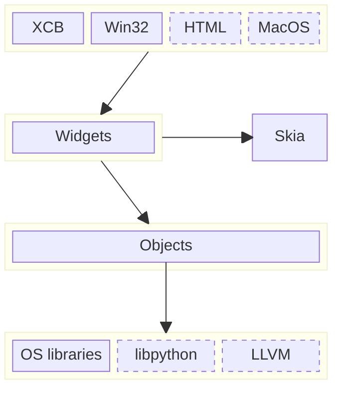

This doc is meant for folks who would like to tinker with Automat on their own
machines. It lists the underlying technologies and describes how they're
connected together.

# Goals

The architecture of the project follows its goals:

1. Make Automat simple to use:
  - Single-binary distribution (no installation required)
  - Isotropic user interface
    - executable across different operating systems
    - simalarity across form factors (desktop, mobile, VR)
    - interoperability with different languages (Python, C, JavaScript)
    - same tools work for different domains
  - Permissive license
2. Lower cognitive load of development:
  - Minimize the number of technologies that developers must be familiar with
  - Shorten the edit-build-debug cycle
  - Support for LSP (Language Server Protocol) for code completion, navigation, and refactoring

# Technologies

Due to the low-level interoperability goal, the project is written in C++ with
some supporting tooling in Python.

A safer base language (such as Rust or one of other C++ successors) is planned
for the future, once the Automat API stabilizes.

## Build system

Automat comes with its own build system, invoked from `run.py` and located in
the `run_py` directory. On the high level the build system follows the *Make*
paradigm - it follows a recipe composed of steps that require some *inputs* and
produce some *outputs*. Most of the steps are generated automatically based on
the contents of the `src` directory.

(Unpopular opinion warning) C++ is actually easy to build but the build systems
complicate this by enforcing a declarative structure, which never quite supports
all of the cases and usually requires user to learn a whole new language. Having
a custom build system fixes both of those issues and allows anyone with Python
knowledge (one of the most popular languages) to tinker with the build process.
Python, as a language, is a great tool for managing complexity so the resulting
code is also more readable than the alternatives.

Each of the files in `run_py` should speak for itself. A copule of them however
are so important that you should know about them. Here is a list, ordered in the
visiting order, for somebody who wants to understand the build system:

- `run_py/fs_utils.py` - defines key directories. Take a look to see where things are stored
- `run_py/args.py` - defines options that control the build process
- `run_py/__main__.py` - entry point, responsible for the high-level control flow
- `run_py/src.py` - responsible for scanning the C++ sources
- `run_py/build.py` - the center of the build process, where the recipe is defined
- `run_py/make.py` - implements the "make" algorithm
- `src/*.py` - extensions that can alter the recipe using `hook_*` functions
- `run_py/autotools.py` - helpers for extensions that use GNU Autotools
- `run_py/debian_deps.py` - takes care of installing dependencies on all sorts of debians

# Architecture

Automat's code is roughly organized around layers (dotted line marks aspirational components):

**The bottommost layer** includes **foreign entities** that Automat interfaces
with. Those are basic OS functions, used through syscalls, Win32 APIs or
libraries. A particularly interesting case are sophisticated libraries that
expose graph-like interface (for example GStreamer, GEGL, ffmpeg, LLVM,
libpython) as they may cleanly map into higher-level layers.

**The second layer** contains the beating heart of Automat - it's a **library of
objects** and a scheduler that controls their execution. Objects can refer to
each other using typed connections. Objects which know each other's memory layout
and API, can directly call each other's methods, and if not - they can rely on
generic interfaces to work with each other. This layer utilizes C++ OOP features
to model the world as a set of plug-and-play virtual devices.

**The third layer** contains **widgets**. They're responsible for displaying
pretty graphics, playing sounds and reacting to users' input. Widgets heavily
rely on [Skia](https://skia.org) as its main abstraction for drawing. The job of
widgets is to take away the heavy resource burden from objects and allow for a
more light-weight base layer.

**The topmost layer** contains frontends that can be used to access Automat.
Some of them correspond to binaries for different platforms, but some of them
may be available even when Automat is running in a headless mode - as a sort of
remote access.

The most interesting places in Automat are definitely the *Object* and *Widget*
layer. The project is evolving quickly so any documentation about those layers
is likely going to be outdated soon. Instead, here is a list of key source
files, that should help you find your way around the codebase:

- `src/library*.hh` - those are Automat's objects. Feel free to spot-check some
of them to see how things are implemented but keep in mind that due to constant
evolution some APIs used by objects may have gotten obsolete. It's a mix of good
and bad stuff. Use your own judgement of which tricks are worth learning.

- `src/object.hh`, `src/argument.hh`, `src/connection.hh` - the basic types.
Note that objects themselves use C++ OOP mechanisms to define their types and
interfaces, but connections can be typed using the `Argument` class, which makes
it possible to introduce new connection types dynamically, at runtime.

- `src/base.hh` - defines a couple interfaces used by objects to do their work &
communicate with each other.

- `src/board.hh` - defines the *Board* class. It's a kind of object that can combine
several other objects into a single one.

- `src/location.hh` - *Location* is responsible for storing objects and
providing them with API for finding other objects and interacting with them.
It's pretty inconspicuous but also probably the most important class in the
whole project.

- `src/automat.cc` - this is where the *main* function is located. Good place to
start if you want to see how the Automat interacts with the OS windowing system.

- `src/window.hh` - a cross-platform abstraction for a window. This is where all
of the platform-specific frontends (Win32, XCB) become one.
