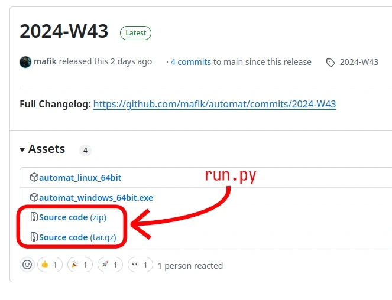

# Release Process

## Objectives

1. Provide a good first-time user experience for new Automat users
2. Minimize development TOIL

## Release Schedule

Automat releases weekly. This was chosen because it allows enthusiasts to periodically check out newest builds at a human-friendly schedule and doesn't create too much overload.

Each release is tagged (on git) with an ISO-8601 week (for example `2024-W43`).

Weekly release is normally triggered automatically on Monday (midnight CE(S)T) and if things go well, appears on GitHub within an hour. The code responsible for that can be found in `release.py`, `release.timer` and `release.service`.

### Forks

Forks of Automat can set up their own weekly release by enabling the systemd `release.timer` & `relase.service`:

```bash
systemctl --user enable /<absolute automat dir>/src/release.timer
systemctl --user enable /<absolute automat dir>/src/release.service
```

And then customizing `release.py` (replace instances of `mafik` with your GitHub username).

Lastly, one must also add their personal access token to `/etc/credstore/GITHUB_TOKEN`. This can be obtained by clicking on your GitHub avator => Gears icon => Developer Settings => Personal Access Tokens => Fine-grained tokens => Generate new token => granting read & write access to repository "Actions" and "Contents". Make sure that the file can be accessed from your user account.

## `main` must be always green

Automated releases are highly vulnerable to regressions. Because of that, the `main` branch on GitHub (which is the source for weekly releases) should always compile and pass the tests. It's ok to break the compilation during local development, but the GitHub `main` should always be in a working state.

This is necessary not only for the weekly release automation, but also for other developers who might want to build Automat from source. It would be a fairly bad experience if the code checked out from `main` didn't build!

Currently it's a responsibility of the pushing developer to run the necessary tests but this should be automated in the future.

## Release Builders

Release code from `release.py` relies on GitHub Actions to build Automat for different platofrms (see `build.yaml`). This has some advantages (ensures that users on those platforms also can build the release) but also ties Automat to GitHub. 

The risk for GitHub's entshittification is high (it's the current monopolist in the space) so it's necessary to take precautions. All functions relying on GitHub should be implemented with eventual replacement in mind.

The current plan B for release builders is to have some SSH-able machines running different platforms, that could be contacted by `release.py` to build Automat for release.

## Upgrade Process

Automat discourages unnecessary updates.

Updates come with a risk of regressions and quite often break the muscle memory that existing users already developed. The two main arguments for updates are "new features", which are only welcomed by enthusiasts, and "security fixes", which are hardly relevant in the context of local software.

It's possible that somebody may still want to update Automat (for example to get access to new features) and at the same time retain the machines that they built in an old version. Because of that Automat tries to be as backwards-compatible as possible (sometimes too expensive). The backup strategy employed by Automat is to try to load the old format where it's compatible and if there are any issues, emit them as new "error" objects - allowing recovery by patient users.

### Customizing Automat

In the case where compatibility issues prevent users from upgrading their existing Automat installations to the latest release, Automat releases come with sources and a built-in build system that allows experienced users to customize their build.



This is the same build system that is normally used for development. Downloading the source `.zip` file, extracting it and running `./run.py release_automat` should build an identical (but not bit-identical) version of Automat to the one from the official release.

With a working build environment, users are free to tweak Automat to their liking by editing the sources.

In the future a better infrastructure may come for customizing Automat (browsing and applying patches). Possibly from  within Automat itself...

## Security

Security issues are handled using the process described in the [Security Policy](https://github.com/mafik/automat/tree/main?tab=security-ov-file).

Security fixes are not backported to past weekly releases due to limited attack surface that Automat enjoys as a local software.

## Versioning

Automat aspires to be usable as a library (embeddable into other apps) but it's not possible yet. When this happens it will be useful to also have a versioning scheme compatible with SemVer. A semver versioning can be used in parallel with week-based versioning.

## Future Work

- [ ] Improve release notes by highlighting commits with `fix:` and `feat:` prefixes
- [ ] Design a system for automated testing before pushing to `main` (see GitHub branch protection)
- [ ] Explain the process for customizing Automat on the release page
- [ ] Highlight large features by including a "Milestone" name in the release name
